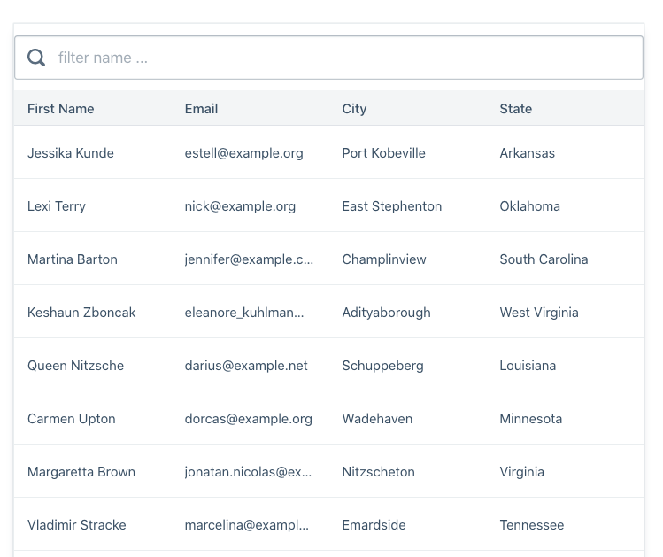

# Day 1 - 4/27/2020

### List of Components

* App
    * Search
    * List - Done
        * List of Employees - Done
        * Loading Animation, data not found feature
    * Single Employee Component

* What we practiced?
    * Passing data to components
    * fetch api calls, best practices
    * Conditional rendering
    * Updating State
    * Arrow Functions
    * Rendering list data
    * Debugging

* What we learned?
    * componentDidMount
    * loading feature/animation

## Homework
    * Search Feature

## Image

# Day 2 - 4/28/2020

* What we practiced?
    * Project structure
    * Stateless/Functional Component
    * Passing data/callbacks

* What we learned?
    * How to filter data by multiple values
    * setState callback

## Homework
    * Search Feature
    * Search by user input 

# Day 3 - 4/29/2020
* What we practiced?
    * Search Input - Controlled
    * Select Options
    * Terniary operators
    * Arrow functions
    * Css
    * Table UI

* What we learned?
    * Map/Filter Higher order functions
    * Modularizing
    * && operators

# Day 4 - 4/30/2020

* What we practiced?
    * sorting tabular data columns
    * difference between id and index
    * filter and delete employees from tabular data

* What we learned?
    array reverse function
    toggle when sort

## homework
 * make null values when we sort descending (to 1.option)
 * add sorting icons so that flips depending on the sorting: asc, desc
 * make row heights similar 

# Day 5 - 5/01/2020
* What we practiced?
    
* What we learned?

<!-- Pagination -->
1. simple paginaton
2. pagination with number
3. library for pagination
<!-- 4. scroll pagination -->

## Desired Features
    * CRUD app
    * Single User Component
    * Add Graph - Login History
    * Add new libraries (sass, bootstrap, react-router)
